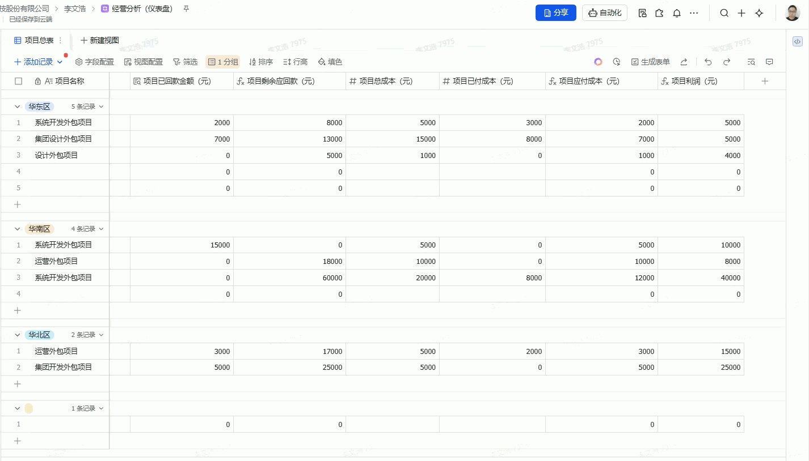

# 飞书多维表格签字插件

一个用于飞书多维表格的边栏签字插件，支持在表格中选中记录后直接手写签名，签名图片自动回写到对应记录的附件字段中。

**GitHub Pages 部署地址：** https://liwenhao0427.github.io/feishu-sign/

**仓库地址：** https://github.com/liwenhao0427/feishu-sign

---

## ✨ 核心功能

### 1. 选中即签 — 零操作成本
无需在插件内手动选择记录。在表格中点击任意一行，右侧插件自动识别当前记录并展示签字界面，同时显示该记录的文本字段摘要，确保签对人、签对行。

### 2. 手写签名 — 自定义笔触
内置手写签名画布，支持 3 种笔画颜色（黑色 / 蓝色 / 红色）和 3 档粗细调节，满足不同签字风格需求。签名完成后自动转为 PNG 图片保存。

### 3. 签名回写 — 自动归档
确认签字后，签名图片自动写入当前记录的「签字图片」附件字段，无需手动上传。插件首次运行时会自动创建所需字段，开箱即用。

### 4. 签名管理 — 可查可改可清
已签名的记录会展示签名图片预览，支持「重新签名」覆盖原有签名，也支持「清除签名」彻底删除附件内容，流程可逆不怕签错。

### 5. 轻量部署 — 纯前端方案
纯前端插件，无需后端服务。支持 GitHub Pages 一键部署，也可提交到飞书插件中心供团队使用。

---

## 功能演示



---

## 📖 使用指南

### 安装插件

1. 打开飞书多维表格，点击顶部工具栏的「插件」按钮展开插件面板
2. 点击「自定义插件」→「+ 新增插件」
3. 在输入框中填入部署地址：`https://liwenhao0427.github.io/feishu-sign/`
4. 点击确定，插件加载完成

### 签字流程

1. 在表格中点击选中需要签字的记录行
2. 右侧插件自动显示该记录的摘要信息和签字状态
3. 在画布区域手写签名（可切换颜色和粗细）
4. 点击「确认签字」，签名图片自动保存到该记录的「签字图片」字段
5. 如需修改，点击「重新签名」或「清除签名」

### 注意事项

- 插件首次运行会自动在表中创建「签字图片」附件字段
- 签字前请确认插件中显示的记录信息与目标行一致
- 清除签名会同时删除附件字段中的图片文件

---

## 🛠 本地开发

```bash
# 安装依赖
npm install

# 启动开发服务器
npm run dev

# 构建生产版本
npm run build
```

启动后将 `localhost:5173` 填入多维表格自定义插件的运行地址即可预览。

## 部署

### GitHub Pages

项目已配置 GitHub Actions 自动部署，push 到 `main` 分支后会自动构建并发布。

1. 在 GitHub 仓库 Settings → Pages → Source 中选择 **GitHub Actions**
2. push 代码到 `main` 分支
3. 部署完成后访问 `https://liwenhao0427.github.io/feishu-sign/`

### 飞书插件中心

1. 执行 `npm run build` 生成 `dist` 目录
2. 确保 `package.json` 中 `"output": "dist"` 已配置
3. 提交代码到 GitHub 仓库（包含 `dist` 目录）
4. 填写[插件发布表单](https://feishu.feishu.cn/share/base/form/shrcnwTXnFVAbMPOSeaOFwIAnbf)提交审核

---

## 技术栈

- React 18 + TypeScript
- [Base JS SDK](https://lark-base-team.github.io/js-sdk-docs/zh/) — 飞书多维表格前端 SDK
- [react-signature-canvas](https://www.npmjs.com/package/react-signature-canvas) — 手写签名画布
- Vite — 构建工具

## 项目结构

```
src/
├── App.tsx                          # 主界面
├── main.tsx                         # 入口
├── components/
│   ├── SignatureCanvas.tsx           # 签名画布（颜色/粗细选择）
│   ├── SignaturePreview.tsx          # 签名图片预览
│   └── ActionButtons.tsx            # 操作按钮
└── hooks/
    ├── useFieldInitialization.ts     # 字段自动创建
    ├── useSelectionChange.ts         # 监听记录选中
    ├── useRecordSignStatus.ts        # 签名状态检查
    ├── useRecordSummary.ts           # 记录摘要读取
    ├── useSignatureSave.ts           # 签名保存
    └── useSignaturePreview.ts        # 签名图片预览
```

## 许可证

MIT
